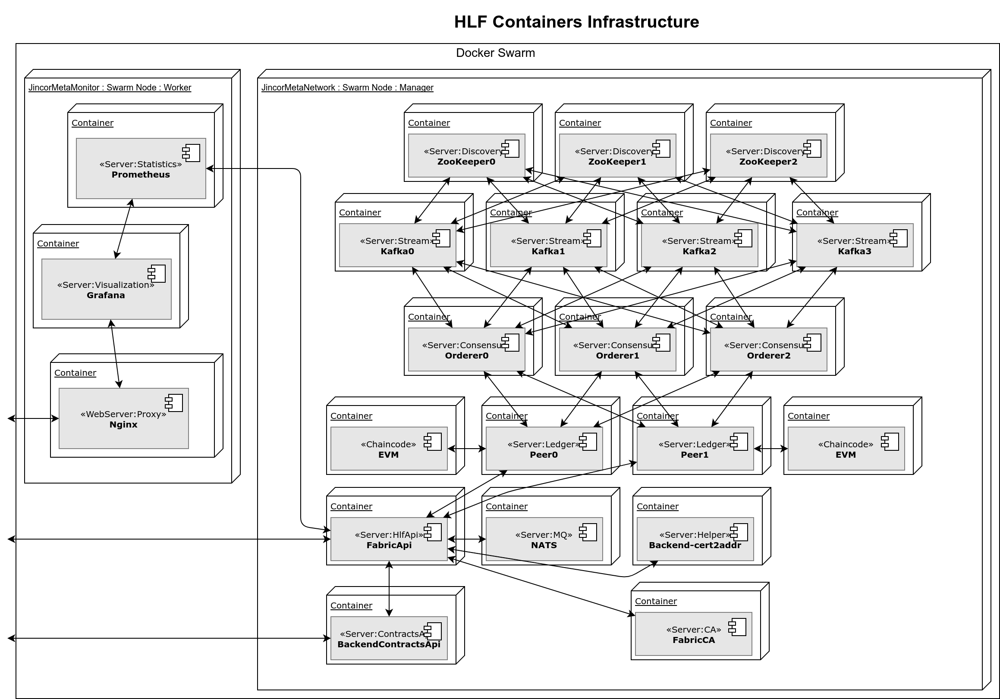
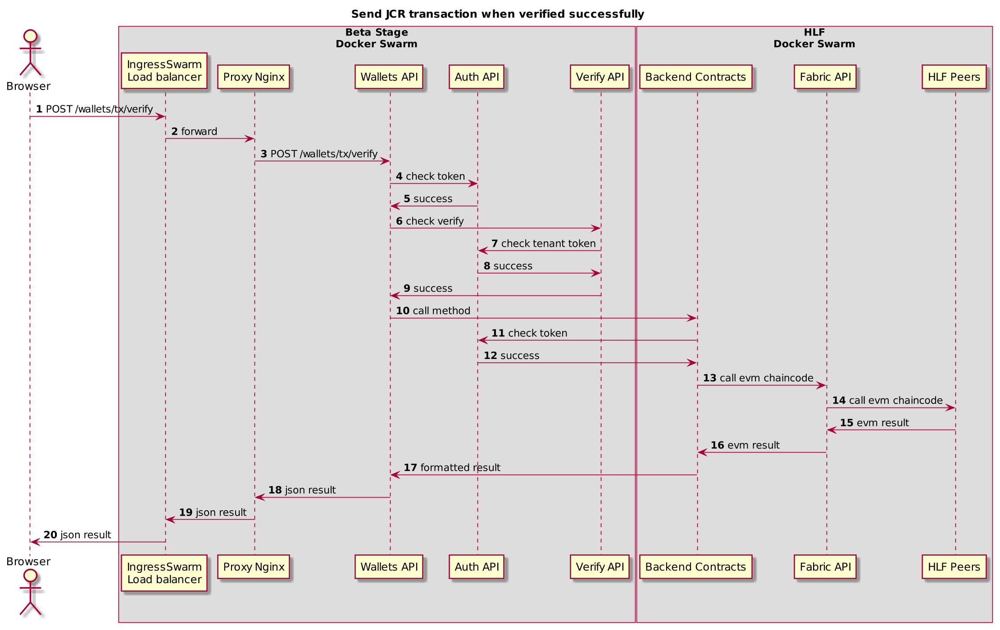

Hyperledger Fabric in the Beta
===============================

Introduction
-------------

The Hyperledger Fabric is used as blockchain platform.
The main distinctions of this blockchain are permissions and private channels.
Permissions mean only identified nodes interact in blockchanin, and private channel
is separated blockchain between nodes (physically no data transmitted to another nodes
not included in channel).

Currently only one channel is used. This network emulate a ethereum behavior,
except for nodes permission.

For more details, read [Hyperledger Fabric](https://hyperledger-fabric.readthedocs.io) and
[Whitepaper](https://jincor.com/whitepaper).

**Note**. No any connection is implemented for real ethereum network, this is emulation only.

Related Repositories
---------------------

The core of Beta blockchain consists of repositories:

1. [Sandbox](https://github.com/JincorTech/hyperledger-fabric-sandbox).
  `https://github.com/JincorTech/hyperledger-fabric-sandbox/tree/master/jincor-meta-network` contains files for
  deploying current *jincormetanetwork* blockchain. *DevOps* - is for run containers in docker swarm mode,
  *Bootstrap* is for pre-configure cryptographic environment (with using of openssl, cryptogen or fabric-ca).
  *Monitoring* is for HLF metrics.
1. [EVM-Chaincode](https://github.com/JincorTech/hyperledger-fabric-evmcc).
  Ethereum Virtual Machine as chaincode for HLF. Adapted from [Burrow](https://github.com/hyperledger/burrow).
1. [FabricAPI](https://github.com/JincorTech/hyperledger-fabricapi).
  REST service to interact (internally using [Nodejs SDK](https://github.com/hyperledger/fabric-sdk-node)) with HLF.
1. [Cert2Addr](https://github.com/JincorTech/backend-cert2addr).
  Microservice gives ability to get address (similar as in ethereum) from the x.509 certificate of client.
1. [Contracts](https://github.com/JincorTech/backend-contracts).
  REST service is need to encapsulate of working with *FabricAPI* service. *Contracts* is used for working with Etheruem
  smart-contracts (deployed in beta jincor blockchain). Provided WebSocket server to emit events from
  Beta blockchain.
1. [Wallets](https://github.com/JincorTech/backend-wallets).
  REST service is neet to encapsulate of working with concrete smart-contracts (JincorToken, EmploymentAgreement, and etc.).

High-Level Architecture
------------------------

For production blockchain, [Kafka](https://hyperledger-fabric.readthedocs.io/en/release/kafka.html) mode is used.
Jincor blockchain is working on manager node 172.104.144.37 in docker swarm mode, and worker node is 139.162.201.204 only for
metrics. Few ports is opened for a public: *49090* ([FabricApi](https://github.com/JincorTech/hyperledger-fabricapi)),
*59090,59091* ([backend-contracts](https://github.com/JincorTech/backend-contracts)), 48080 ((Grafana)[https://grafana.com]).
All other services working in private overlay network (docker swarm).

After "bootstrapping" the network has 2 channels: *jincormetanet*, *jincormetatnetest*.

Ethereum [JincorToken](https://github.com/JincorTech/ico/blob/master/contracts/JincorToken.sol)
smart-contract is deployed in both channels (address is
*0x8e5983833a2cfd195b9055447822a37adcb022b1*).

All containers and their TCP communications are drawn on the figure below.

Default configuration for Zookeeper, Kafka, Orderers is gotten from recomendation of HLF manual.
Two peers is for High Availability mode. Configuration exists in
[Sandbox](https://github.com/JincorTech/hyperledger-fabric-sandbox) repository.
*[Nats](https://nats.io/)* is used only for processing of realtime events, *FabricApi* publish
a message when events are occurred in HLF (Block, Transaction, EVM).
Any concerned services should subscribe on events, *Backend-contracts* is subscribed and
transmit all events to WebSocket server.

Metrics is provided by *FabricAPI* service as for *[Prometheus](https://prometheus.io/)*
endpoint: http://172.104.144.37:49090/metrics/prometheus.

Local Installation
-------------------

Ensure you have last docker version and it's in swarm mode.

1. `$ git clone git@github.com:JincorTech/hyperledger-fabric-sandbox.git`
1. `$ cd jincor-meta-network/bootstrap`
1. `$ bash init.sh config` to initiate crypto environment (wait over 5 minutes).
1. `$ bash init.sh channels` to prepare orderer and channel genesis blocks.
1. `$ cd ../devops`
1. `$ bash init.sh all` to prepare volumes for services.
1. `$ docker stack deploy -c docker-compose-stack.yaml` to launch all services.
1. `$ bash init.sh jincornetwork ` to join peers to *jincormetanet*, *jincormetanettest* channels.
1. `$ docker pull jincort/hlf-ccenv:x86_64-1.1.0`
1. `$ docker tag jincort/hlf-ccenv:x86_64-1.1.0 hyperledger/fabric-ccenv:x86_64-1.1.0-alpha-snapshot-01859c3` to make alias for chaincode builder.

At this moment you have clean HLF with 2 peers and 2 channels.

Seq Diag Transaction Example
-----------------------------

The full requests between services are showen on the diagram below.
Let's look on a process for making a transaction in our Beta blockchain.

There are no *mongo* and *redis* communications presented here.

Steps description:

* 3-5. After Browser requesting the *Wallet* to confirm a transaction,
  a user *Access Token* is checking validity through *Backend-Auth* service.
* 6-9. Validate user confirmation code and confirm the intention to start
  tranasction in Beta blockchain.
* 10 The *wallets* call *contracts* to execute transaction.
* 11-12. *Contracts* also validating of user *Access Token* (forwarding by *Wallets*).
  There is no real access to this service by user, only through *Wallets*.
* 13-14. Call EVM chaincode to make a transaction for user.
* 15-20. Return result of transaction to a user. Only *Backend-contracts* transform
  request and response by EVM specification.

**Note**. Asynchronous execution.
After transaction is executed, the HLF produce a transaction event, then catching
by FabricApi and publishing to *Nats*, *Contracts* receive a message with a
transaction event, decode it and publish it to the WebSocket, *Wallets* catch
an event transaction and mark it status in the *Mongo*.

**Note**. HLF Peers requesting a EVM chaincode (in the separated docker container),
then send a result of transaction to the orderers.
